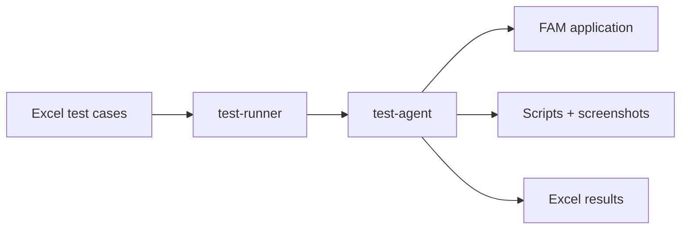

# FAM_Testing

Automated functional testing for **FAM** (Financial Application Management)—an Oracle APEX web application with Keycloak SSO. This workspace combines **Playwright** UI automation, **Excel-driven** test definitions, and **Cursor AI agents** that execute full test cases and produce re-runnable Python scripts.

## Overview

| Capability | Description |
|------------|-------------|
| **UI automation** | Playwright drives the FAM browser UI (login, navigation, grids, dialogs). |
| **Excel orchestration** | Test cases are defined in a workbook; results are written back to **Result** and **Remark** columns. |
| **Agent workflow** | `test-runner` reads Excel and delegates each test to `test-agent`, which runs all steps in one session. |
| **Deliverables** | Per test: `{testcase_name}.py` script and `screenshots/{testcase_name}/` evidence. |

## Workflow



1. Define test cases and steps in **Excel**  
2. Run **`/test-runner`** — reads the workbook and invokes **test-agent** once per test row  
3. **test-agent** executes all steps against **FAM** (Playwright UI automation)  
4. Outputs a **Python script**, **screenshots**, and writes **Result / Remark** back to Excel  

Standalone scripts (`FAM_TestCase_001.py`, `FAM_TestCase_002.py`) run the same UI flow directly without the agent workflow.

## Prerequisites

- **Python 3.10+**
- **Chromium** (via Playwright browser install)
- Network access to the FAM dev environment
- **Cursor** (for Excel-driven agent runs via `test-runner` / `test-agent`)
- **Microsoft Excel** or compatible tool for editing test workbooks (close the file before runs so agents can save results)

## Quick start

### 1. Clone or open the workspace

```powershell
cd "c:\Users\kumvik01\OneDrive - CSG Systems Inc\Projects\AICursor_Workspace\FAM_Testing"
```

### 2. Create a virtual environment and install dependencies

```powershell
python -m venv .venv
.\.venv\Scripts\Activate.ps1
pip install -r requirements.txt
playwright install chromium
pip install openpyxl
```

### 3. Configure environment variables

Copy or edit `.env` in the project root. Typical variables:

| Variable | Purpose |
|----------|---------|
| `APEX_USER` | FAM / Keycloak username |
| `APEX_PASS` | Password |
| `APEX_LOGIN_URL` | Application entry URL |
| `APEX_BASE_URL` | Base APEX URL (if used by tests) |

Do not commit real credentials to source control.

### 4. Run a standalone test script

Two self-contained Playwright scripts are included:

```powershell
python FAM_TestCase_001.py
python FAM_TestCase_002.py
```

Each script launches Chromium (non-headless by default), logs into FAM, navigates **Financial Management → Manage Documents**, filters by transaction type and billing period, opens **View Document Summary** for a specific agreement, and prints captured invoice fields. Screenshots are saved under `screenshots/FAM_TestCase_00X/`.

## Test cases

| Script | Transaction type | Agreement | Billing period |
|--------|------------------|-----------|----------------|
| `FAM_TestCase_001.py` | ACCRUALS | `RJILKO_AIRTTN_Exp` | 2026/02/01 - 2026/02/28 |
| `FAM_TestCase_002.py` | ACTUAL | `RJILDL_AIRTKN_ACTUAL_OFF_E_SO` | 2026/02/01 - 2026/02/28 |

Both tests follow the same high-level flow:

1. Login via Keycloak SSO  
2. Open **Manage Documents**  
3. Filter by transaction type and billing period  
4. Open **View Document Summary** for the target agreement  
5. Extract invoice header fields and usage/tax sums from the summary dialog  

## Excel-driven automation (Cursor)

For batch execution from a workbook, use the **test-runner** Cursor command with the path to your Excel file:

```text
/test-runner Functional_Test_Cases.xlsx
```

### How it works

- **test-runner** (`.cursor/commands/test-runner.md`) — Parses the workbook, skips invalid rows, invokes **test-agent** once per test with the full step block.  
- **test-agent** (`.cursor/agents/test-agent.md`) — Executes every step in order (UI via Playwright MCP; SQL/SSH/REST/SOAP per rules), writes Excel results, and generates the Python script.  
- **test-rules** (`.cursor/rules/test-rules.md`) — Step inference, context passing, UI/DB/API protocols, error handling, and output conventions.

### Excel format

Place test definitions in `Functional_Test_Cases.xlsx` (or pass another workbook path to test-runner). Use a sheet named **Test Cases** or **Tests** if present; otherwise the first sheet is used.

**Row 1 — headers** (case-insensitive):

| Column purpose | Accepted header names |
|--------------|------------------------|
| Test name | `Test Name`, `Test Case Name`, `TestCase`, `TestCase Name`, `Name` |
| Steps | `Test Step`, `Test Steps`, `Step Definition`, `Step Definitions`, `Steps` |
| Result (output) | `Result`, `Status`, `Test Result` |
| Remark (output) | `Remark`, `Remarks`, `Comments`, `Failure Reason` |

**Row 2+** — one test per row. The **Steps** cell should contain the complete step list (Step 1 … Step N) in a single cell or multiline block.

Before running, ensure the Excel file is **writable** and **not open** in Excel.

### Inspect workbook contents

Use the helper script to list sheets, headers, and parsed test rows:

```powershell
python _read_tests.py
```

This expects `Functional_Test_Cases.xlsx` in the project root.

## Project structure

```text
FAM_Testing/
├── .cursor/
│   ├── agents/test-agent.md      # Test execution subagent
│   ├── commands/test-runner.md   # Excel orchestration command
│   └── rules/test-rules.md       # Step protocols and deliverables
├── .env                          # Environment credentials (local only)
├── FAM_TestCase_001.py           # Standalone ACCRUALS test
├── FAM_TestCase_002.py           # Standalone ACTUAL test
├── _read_tests.py                # Excel workbook inspector
├── requirements.txt              # Python dependencies
├── screenshots/                  # Per-test screenshots (created at runtime)
├── Functional_Test_Cases.xlsx    # Test case workbook (add your file)
├── requests/                     # REST/SOAP payload templates (optional)
└── Keywords/                     # DBLibrary.py, SSHLibrary.py (optional, for SQL/SSH steps)
```

Generated artifacts (not always in source control):

- `{testcase_name}.py` — Re-runnable script produced by test-agent  
- `screenshots/{testcase_name}/` — Step evidence images  

## Dependencies

From `requirements.txt`:

| Package | Use |
|---------|-----|
| `playwright` | Browser automation |
| `pytest` | Test framework (optional runner) |
| `python-dotenv` | Load `.env` configuration |
| `openpyxl` | Read/write Excel workbooks (install separately if needed) |

## Step types (agent runs)

When using test-agent, each step is classified from its instruction text:

| Type | Typical actions |
|------|-----------------|
| **UI** | Login, navigation, clicks, form fills, on-screen verification |
| **REST** | HTTP calls with JSON payloads under `requests/` |
| **SQL** | Oracle queries via `Keywords/DBLibrary.py` |
| **SOAP** | XML/SOAP via `zeep` or raw requests |
| **BACKEND** | Remote commands via `Keywords/SSHLibrary.py` |

Values extracted in earlier steps are stored in a shared `context` dict and must not be hardcoded in later steps.

## Troubleshooting

| Issue | What to try |
|-------|-------------|
| Excel save fails | Close the workbook in Excel; confirm the path is writable. |
| Login or SSO errors | Verify `.env` credentials and `APEX_LOGIN_URL`; confirm VPN/network access. |
| HTTPS / certificate warnings | Standalone scripts use `ignore_https_errors=True` in Playwright context. |
| Element not found | Re-run with UI steps; agents use fresh `browser_snapshot` per test-rules. |
| Missing `Keywords/` or `requests/` | Add libraries/payloads only if your Excel steps require SQL, SSH, or API calls. |

## Security notes

- Keep `.env` local and out of version control.  
- Standalone scripts may embed dev URLs and credentials; prefer loading from `.env` for new tests.  
- Screenshots may contain sensitive billing data—handle according to your organization’s data policy.

## License and ownership

Internal CSG FAM testing workspace. Adjust URLs, agreements, and billing periods to match your target environment before production-style runs.
